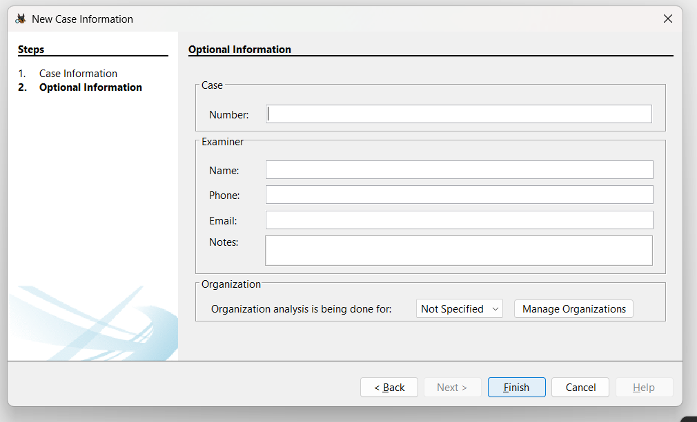
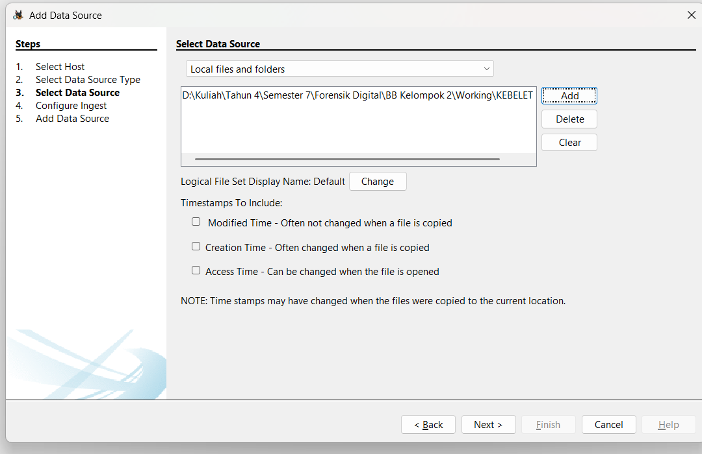
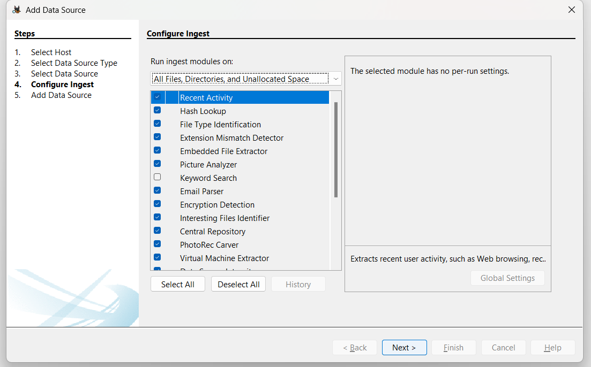
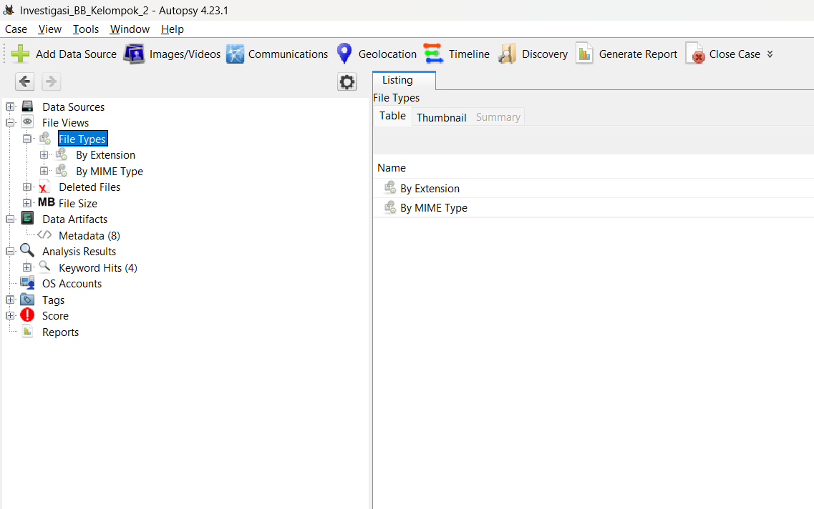
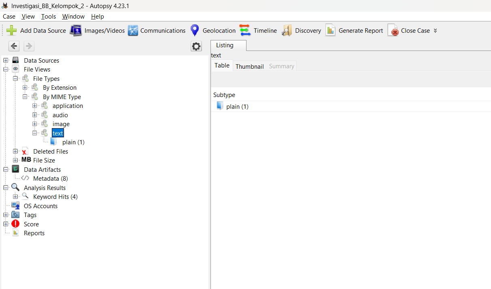
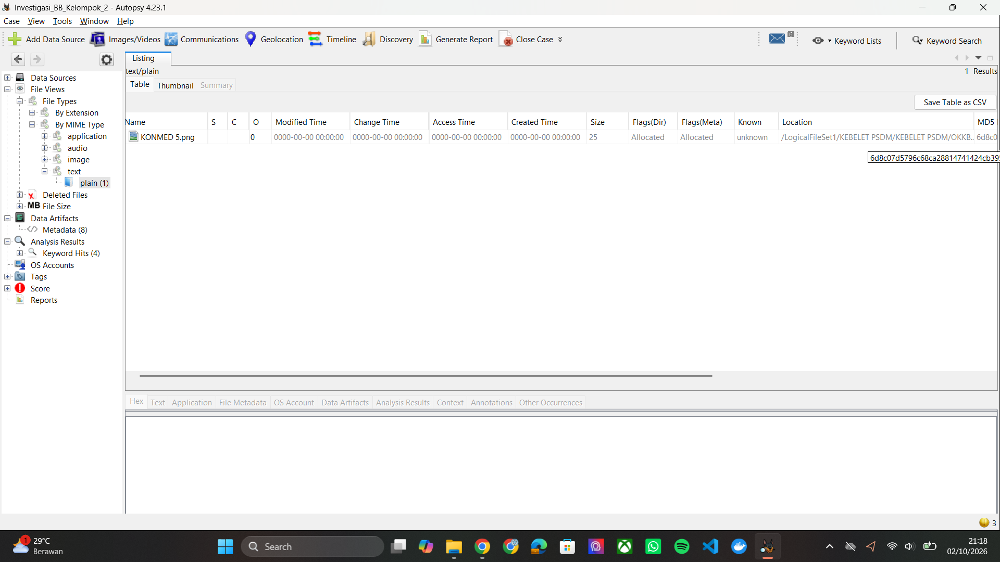
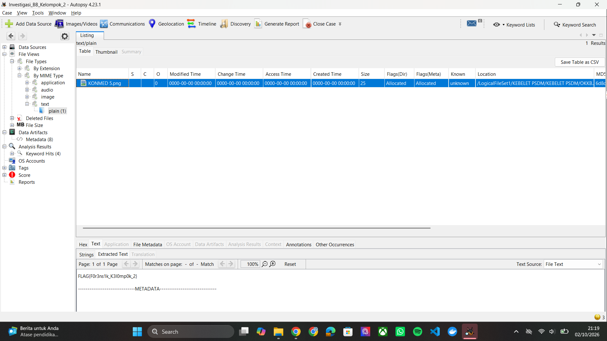

# Investigasi Forensik Digital - Kelompok 2

Dokumentasi proses investigasi barang bukti digital milik **Kelompok 2** yang dilakukan oleh **Kelompok 4**.

---

## Informasi Investigasi

| Parameter | Detail |
|---|---|
| Investigator | Kelompok 4 |
| Target Investigasi | Kelompok 2 |
| Barang Bukti | `KEBELET PSDM.zip` |
| Tool | Autopsy 4.23.1 |
| Metode Analisis | Logical File Analysis |
| Status | Solved |

---

## Tujuan Investigasi

Investigasi dilakukan untuk menemukan **keyword atau flag** yang disembunyikan pada barang bukti digital milik Kelompok 2.

Pemeriksaan difokuskan pada identifikasi file yang memiliki karakteristik tidak wajar, khususnya dengan melihat **tipe file, MIME type, dan kesesuaian antara ekstensi dengan tipe file sebenarnya**.

---

# Proses Investigasi

## 1. Persiapan Barang Bukti

Barang bukti yang diterima berupa file:

```text
KEBELET PSDM.zip
```

Untuk menjaga integritas barang bukti, file asli tidak digunakan secara langsung untuk proses analisis. Sebagai gantinya, dibuat salinan kerja (*working copy*) yang digunakan selama proses pemeriksaan.

Struktur folder kerja yang digunakan:

```text
BB Kelompok 2/
├── Original/
│   └── KEBELET PSDM.zip
│
├── Working/
│   └── KEBELET PSDM/
│
└── Case_Autopsy/
```

Folder `Original` digunakan untuk menyimpan barang bukti asli, sedangkan proses analisis dilakukan menggunakan salinan pada folder `Working`.

Barang bukti asli tidak dimodifikasi selama proses investigasi.

---

## 2. Membuat Case pada Autopsy

Tool utama yang digunakan untuk melakukan analisis adalah **Autopsy 4.23.1**.

Setelah Autopsy dibuka, dibuat case baru melalui menu:

```text
Create New Case
```

Case diberi nama:

```text
Investigasi_BB_Kelompok_2
```

Base directory diarahkan ke folder `Case_Autopsy` yang telah disiapkan sebelumnya.

Case ini kemudian digunakan sebagai workspace untuk seluruh proses pemeriksaan barang bukti.

### Dokumentasi



---

## 3. Menambahkan Data Source

Setelah case berhasil dibuat, working copy dari barang bukti ditambahkan ke dalam Autopsy.

Pada tahap pemilihan sumber data, digunakan:

```text
Data Source Type:
Logical Files
```

Kemudian folder hasil ekstraksi dari working copy dipilih sebagai data source.

Metode **Logical Files** digunakan karena barang bukti yang dianalisis berupa kumpulan file hasil ekstraksi dari arsip ZIP, bukan forensic image dari media penyimpanan fisik.

### Dokumentasi



---

## 4. Konfigurasi Ingest Modules

Setelah data source ditambahkan, Autopsy menampilkan konfigurasi **Ingest Modules**.

Modul yang digunakan untuk membantu proses identifikasi dan pemeriksaan file meliputi:

- **File Type Identification**
- **Extension Mismatch Detector**
- **Embedded File Extractor**
- **Keyword Search**

Konfigurasi tersebut kemudian dijalankan terhadap data source yang telah ditambahkan.

Tujuan tahap ini adalah memperoleh informasi mengenai karakteristik file dan menemukan artefak yang berpotensi mencurigakan.

### Dokumentasi



---

## 5. Pemeriksaan File Types

Setelah proses ingest selesai, dilakukan pemeriksaan terhadap klasifikasi file melalui menu:

```text
File Views
→ File Types
```

Pemeriksaan ini dilakukan untuk melihat bagaimana Autopsy mengenali file berdasarkan tipe file yang terdeteksi.

Dari hasil pemeriksaan, perhatian kemudian diarahkan pada kategori file yang memiliki tipe tidak biasa atau tidak sesuai dengan ekstensi yang digunakan.

### Dokumentasi



---

## 6. Pemeriksaan MIME Type

Pemeriksaan kemudian dilanjutkan melalui klasifikasi berdasarkan **MIME Type**.

Pada bagian:

```text
File Types
→ By MIME Type
→ text
→ plain
```

ditemukan satu file:

```text
KONMED 5.png
```

File tersebut diklasifikasikan oleh Autopsy sebagai:

```text
MIME Type: text/plain
```

Temuan ini menjadi indikasi yang perlu diperiksa lebih lanjut karena nama file menunjukkan ekstensi `.png`, sedangkan tipe yang terdeteksi adalah `text/plain`.

### Dokumentasi



---

## 7. Identifikasi File Mencurigakan

File yang ditemukan pada kategori `text/plain` kemudian diperiksa lebih lanjut.

File tersebut adalah:

```text
KONMED 5.png
```

Informasi yang ditampilkan Autopsy:

| Atribut | Hasil |
|---|---|
| Nama File | `KONMED 5.png` |
| Ekstensi | `.png` |
| MIME Type | `text/plain` |
| Ukuran | 25 bytes |

Terdapat ketidaksesuaian antara ekstensi file dan tipe file yang terdeteksi:

```text
Ekstensi:
.png

Tipe terdeteksi:
text/plain
```

File tersebut kemudian dipilih untuk mengetahui isi sebenarnya.

### Dokumentasi



---

## 8. Pemeriksaan Isi File

Setelah file `KONMED 5.png` dipilih, isi file diperiksa melalui tampilan **Text** pada Autopsy.

Hasil pemeriksaan menunjukkan bahwa file tersebut berisi teks, bukan data gambar PNG.

Isi file yang ditemukan adalah:

```text
FLAG{F0r3ns1k_K3l0mp0k_2}
```

Temuan tersebut merupakan flag yang dicari dalam proses investigasi.

### Dokumentasi



---

# Hasil Investigasi

Berdasarkan seluruh tahapan pemeriksaan, ditemukan file mencurigakan:

```text
KONMED 5.png
```

File tersebut memiliki karakteristik:

| Atribut | Hasil |
|---|---|
| Filename | `KONMED 5.png` |
| Extension | `.png` |
| MIME Type | `text/plain` |
| Size | 25 bytes |

Ketidaksesuaian antara ekstensi `.png` dan MIME type `text/plain` menjadi indikator yang mengarahkan pemeriksaan lebih lanjut terhadap isi file.

Dari pemeriksaan isi file ditemukan flag:

```text
FLAG{F0r3ns1k_K3l0mp0k_2}
```

---

# Flag

> **`FLAG{F0r3ns1k_K3l0mp0k_2}`**

**Flag berhasil ditemukan pada file `KONMED 5.png`.**

---

# Kesimpulan

Investigasi terhadap barang bukti digital Kelompok 2 berhasil menemukan flag tersembunyi menggunakan **Autopsy 4.23.1**.

Temuan utama berupa file `KONMED 5.png` yang memiliki ketidaksesuaian antara ekstensi `.png` dengan MIME type `text/plain`. Pemeriksaan lebih lanjut terhadap isi file menunjukkan bahwa file tersebut sebenarnya berisi teks yang memuat flag.

Dengan demikian, flag yang berhasil ditemukan adalah:

```text
FLAG{F0r3ns1k_K3l0mp0k_2}
```

---

## Dokumentasi

Seluruh screenshot proses investigasi dapat dilihat pada folder:

[`documentations/`](./documentations/)

| No. | Dokumentasi |
|---:|---|
| 01 | Pembuatan Autopsy Case |
| 02 | Penambahan Data Source |
| 03 | Konfigurasi Ingest Modules |
| 04 | Pemeriksaan File Types |
| 05 | Pemeriksaan MIME Type |
| 06 | Identifikasi `KONMED 5.png` |
| 07 | Pemeriksaan Isi dan Flag |