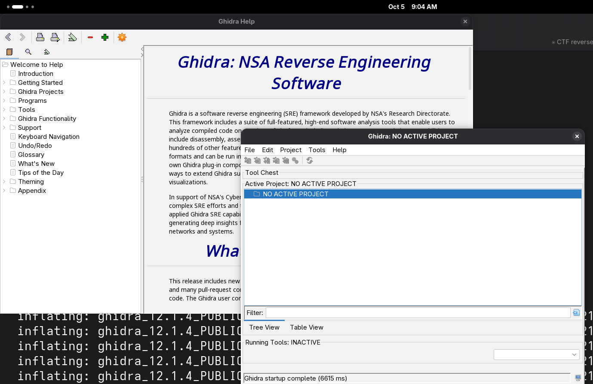
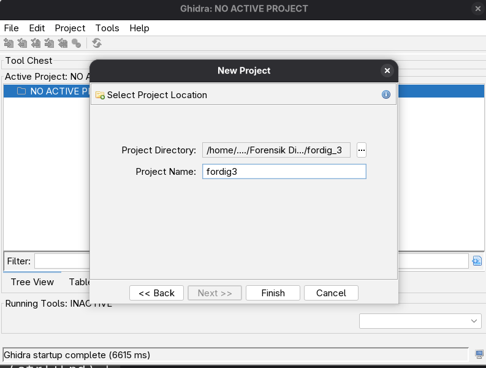
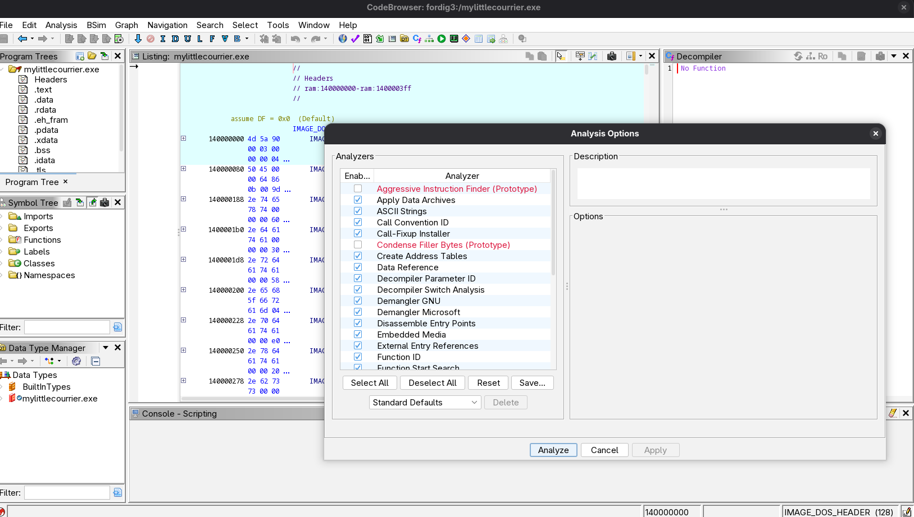
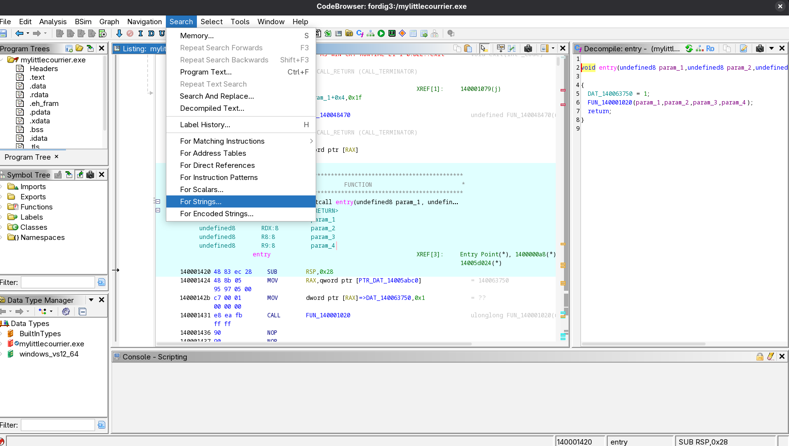
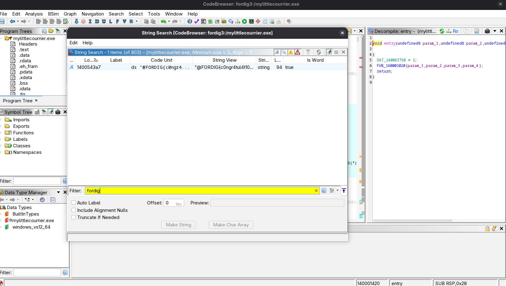
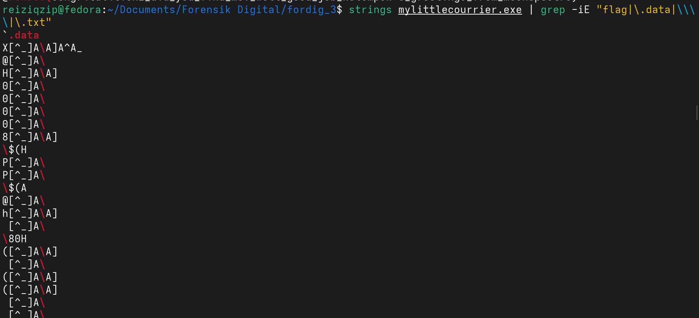

# Investigasi Forensik Digital - Kelompok 3

---

## Informasi Investigasi

| Parameter | Detail |
|---|---|
| Target Investigasi | Kelompok 3 — *Nusa Meridian Disaster* |
| Barang Bukti | `Fordig_Kelompok3_Chall.zip` → `mylittlecourrier.exe` + `Fordig_CTF-Style_Kelompok3.pdf` |
| Kategori | Reverse Engineering / Malware Analysis |
| Lingkungan | Fedora Linux (analisis statis, sampel **tidak dijalankan**) |
| Tools | Ghidra 12.1.4, radare2, `strings`, `grep`, `sha256sum`, `base64` |
| Status | **Solved** |

**Hasil singkat:**

| Temuan | Nilai |
|---|---|
| 🚩 Flag | `FORDIG{c0ngr4tul4t10nz_d1d_y0u_f1nd_m3?_w3ll_g00d_j0b_k3l0mp0k-3_gr33t1ng5_fr0m_m00nspectre}` |
| 📁 Hidden path | `.data\flag_obfuscated.txt` (folder staging `.data\`, subfolder per-run `.data\information_<...>\`) |

---

## 1. Instruksi Soal

Di perusahaan fiktif **Nusa Meridian**, seorang karyawan membuka paket yang mengaku sebagai *update* aplikasi internal. Tim keamanan lalu menemukan file mencurigakan di workstation pelatihan dan menduga ada pengumpulan informasi. CISO membagikan sebuah pola teks (base64) di kanal insiden dan meminta analisis lanjutan.

Tujuan yang diminta soal:

1. Identifikasi sampel: tipe file, hash kriptografis, dan observasi awal.
2. Selidiki pola dari percakapan CISO dan hubungannya dengan sampel.
3. Rekonstruksi perilaku sampel: apakah ada pengumpulan data, *local staging*, atau percobaan eksfiltrasi.
4. Temukan flag dan jelaskan langkah analisis yang dapat diulang.

Isi arsip:

```text
Fordig_Kelompok3_Chall.zip
├── Fordig_CTF-Style_Kelompok3.pdf   (skenario + percakapan CISO)
└── mylittlecourrier.exe             (sampel)
```

---

## 2. Alat yang Digunakan

| Alat | Fungsi |
|---|---|
| `file`, `sha256sum`, `md5sum`, `sha1sum` | Identifikasi tipe file dan hash barang bukti |
| `base64` | Mendekode pola dari percakapan CISO |
| Ghidra 12.1.4 | Disassembler/decompiler; pencarian string secara GUI |
| `strings` + `grep` | Pencarian string cepat beserta offset file |
| radare2 | Membuktikan fungsi mana yang memakai string hidden path (cross-reference) |

---

## 3. Langkah Analisis

### 3.1 Identifikasi sampel (Tujuan 1)

```bash
file mylittlecourrier.exe
md5sum mylittlecourrier.exe
sha1sum mylittlecourrier.exe
sha256sum mylittlecourrier.exe
```

| Atribut | Nilai |
|---|---|
| Tipe | PE32+ executable (GUI), x86-64, 11 section, **stripped** (tanpa nama fungsi) |
| Ukuran | 395.776 byte |
| MD5 | `d0a17a88d952223b84784f03299ea263` |
| SHA-1 | `93e50ff581801158f12b3b3f01ac007b8c80d75c` |
| SHA-256 | `158ea0e7668d986b2d54ca059adbf55b87d5adbd732ddf31f8198d83b55db7f5` |

Observasi awal:

- Program ditulis dengan bahasa **Nim** (terdapat string `system.nim`, `osfiles.nim`, `cmdline.nim`) dan memakai library **winim** untuk memanggil Windows API.
- Nama asli program di dalam binary: `combined_v2_gui.exe` (`[!] usage: combined_v2_gui.exe (no-args = self-targeted drop)`).
- Banyak Windows API dimuat saat runtime lewat `GetProcAddress`, bukan lewat import table biasa.

### 3.2 Analisis pola dari percakapan CISO (Tujuan 2)

Pada halaman 2 PDF, CISO membagikan string base64. Dekode:

```bash
echo 'SGVsbG8gdGhlcmUsaW0gdGhlIGRldmVsb3BlciBvZiBjdXN0b20gdGhpcyBtYWxkZXYsdGhpcyBtYWx3YXJlIGlzIG5vdCBmb3IgaGFybWluZyxidXQgZm9yIHRyYWluaW5nICYgbGVhcm4sbGVhZCB0byBDUlRFICYgUEVOMjAwIFJlZCBUZWFtZXIsaWRlbnRpdHkgc2hpZnRpbmd+IG0wMG5zcGVjdHJlLg==' | base64 -d
```

Hasil:

```text
Hello there,im the developer of custom this maldev,this malware is not for harming,but for training & learn,lead to CRTE & PEN200 Red Teamer,identity shifting~ m00nspectre.
```

Hubungan dengan sampel: kalimat yang **sama persis** tersimpan di binary pada offset `0x529c7`. Kebalikannya juga dicek — string dari binary di-encode ulang ke base64 dan hasilnya identik dengan pola CISO:

```bash
strings mylittlecourrier.exe | grep -o "Hello there.*m00nspectre\." | tr -d '\n' | base64 -w0
```

Kesimpulan: pola yang ditemukan CISO adalah **pesan pembuat malware ("m00nspectre")** yang tertanam di sampel. Pesan ini menjadi petunjuk awal bahwa string penting tersimpan sebagai teks biasa di dalam binary.

> Catatan: pada gambar percakapan, karakter sebelum `IG0wMG5zcG` tampil sebagai `~`. Karakter `~` bukan bagian alfabet base64; nilai yang benar adalah `+` (`...c2hpZnRpbmd+IG0w...`), sesuai hasil encode ulang dari binary.

### 3.3 Analisis statis dengan Ghidra (Tujuan 4)

**a. Membuka Ghidra**

Ghidra dijalankan lewat `ghidraRun`. Jendela utama menampilkan *NO ACTIVE PROJECT*.



**b. Membuat project baru**

**File → New Project → Non-Shared Project**, nama project `fordig3`. Setelah itu sampel diimpor lewat **File → Import File** (format terdeteksi otomatis: Portable Executable, x86 64-bit).



**c. Opsi analisis**

Sampel dibuka di CodeBrowser. Pada dialog *Analysis Options*, opsi default dipakai tanpa perubahan, lalu **Analyze**.



**d. Hasil auto analysis**

Ghidra melaporkan beberapa *warning* (wajar untuk binary MinGW/Nim) dan menawarkan lompat ke simbol `entry`. Karena binary di-strip, semua fungsi bernama `FUN_xxxxxxxx`, sehingga pencarian dilanjutkan lewat string.


**e. Pencarian string**

Menu **Search → For Strings…** lalu **Search**.



**f. Filter `fordig`**

Dari 803 string, filter `fordig` menyisakan **1 hasil** di alamat `0x1400543a7` (panjang 94): string flag dengan format `FORDIG{...}`.



### 3.4 Verifikasi flag dengan `strings`

Ghidra tidak wajib untuk soal ini karena flag tersimpan sebagai teks biasa. Percobaan pertama memakai pola `grep` yang terlalu luas, sehingga muncul banyak potongan instruksi mesin yang kebetulan terbaca sebagai teks (`[^_]A\` dan sejenisnya):

```bash
strings mylittlecourrier.exe | grep -iE "flag|\.data|\\\\|\.txt"
```



Daftar string beserta offset file (`-t x`) menunjukkan flag di offset `0x527a7`, berdampingan dengan string terkait penulisan flag:

```bash
strings -t x mylittlecourrier.exe | grep -i "FORDIG{"
```

```text
527a7 @FORDIG{c0ngr4tul4t10nz_d1d_y0u_f1nd_m3?_w3ll_g00d_j0b_k3l0mp0k-3_gr33t1ng5_fr0m_m00nspectre}
```


> Karakter `@` di awal setiap string adalah byte terakhir *header* string Nim, bukan bagian dari isi string.

Verifikasi hash flag:

```bash
echo -n 'FORDIG{c0ngr4tul4t10nz_d1d_y0u_f1nd_m3?_w3ll_g00d_j0b_k3l0mp0k-3_gr33t1ng5_fr0m_m00nspectre}' | sha256sum
# 5f6a9858a7de71baacc2363904a6de840a760e0846d66394f21fa951624b35e5
```

### 3.5 Mencari hidden path

Di sekitar flag terdapat log `[ok] flag written -> .data\flag_obfuscated.txt`. Pencarian yang lebih spesifik:

```bash
sha256sum mylittlecourrier.exe
strings -t x mylittlecourrier.exe | grep -E "\.data|flag_obfuscated|information_"
```

| Offset | String | Arti |
|---|---|---|
| `0x52687` | `[ok] flag written -> .data\flag_obfuscated.txt` | Log sukses penulisan flag |
| `0x52767` | `flag_obfuscated.txt` | Nama file flag |
| `0x528a7` | `[+] sealed: .data\` | Log enkripsi isi folder `.data\` |
| `0x52927` | `\information_` | Nama subfolder per-run |
| `0x58197` | `\.data\` | Nama folder staging |


### 3.6 Bukti kode dengan radare2

Langkah ini membuktikan string hidden path **benar-benar dipakai kode program**, bukan teks yang tidak terpakai.

```bash
r2 -A mylittlecourrier.exe
```


Di dalam prompt r2:

```text
izz~flag_obfuscated,\.data\,information_
axt 0x140059d80
axt 0x140054350
axt @ 0x14003ea03
```


| Perintah | Hasil | Arti |
|---|---|---|
| `axt 0x140059d80` | `fcn.14003f26f` @ `0x14003f723` | Fungsi utama memakai string `\.data\` untuk menyusun path |
| `axt 0x140054350` | `fcn.14003ea03` @ `0x14003eaad`, `0x14003eb74`, `0x14003ed3d`, `0x14003ee20` | Fungsi ini memakai nama file `flag_obfuscated.txt` (fungsi penulis flag) |
| `axt @ 0x14003ea03` | `fcn.14003f26f` @ `0x140040df7` | Fungsi utama memanggil fungsi penulis flag |

Mengapa alamat yang dicari `0x140059d80`, bukan alamat teks `0x140059d97`: Nim menyimpan string literal sebagai struktur `{panjang, pointer}` yang menunjuk ke `{kapasitas, teks}`. Kode merujuk ke struktur tersebut (16 byte sebelum teks + header), sehingga `axt` pada alamat teks tidak menghasilkan apa pun.

Rantai bukti:

```text
fcn.14003f26f (fungsi utama)
   ├─ menyusun path "...\.data\"            ← 0x14003f723
   └─ memanggil fcn.14003ea03               ← 0x140040df7
          └─ menulis "flag_obfuscated.txt"  ← 0x14003eaad, dst.

Hidden path: .data\flag_obfuscated.txt
```

---

## 4. Rekonstruksi Perilaku (Tujuan 3)

Seluruh temuan berasal dari analisis statis (string dan cross-reference). Sampel tidak dijalankan.

| Perilaku | Bukti di binary | Status |
|---|---|---|
| **Pengumpulan data browser** | `Google\Chrome\User Data`, `Microsoft\Edge\User Data`, `Mozilla\Firefox\Profiles`, `Login Data`, `Cookies`, `History`, `Web Data`, `Local State`, `logins.json`, `key4.db`, `cert9.db` | Terverifikasi (string) |
| **Pengumpulan kredensial Windows** | `SECURITY\Policy\Secrets` (LSA Secrets), `SECURITY\Cache` (mscache), `Microsoft\Protect` (DPAPI master key), `Microsoft\Vault` (Credential Manager), `Winlogon` AutoAdminLogon | Terverifikasi (string) |
| **Pengumpulan info sistem & jaringan** | `NetworkList\Profiles`, `WlanSvc\Profiles`, `Terminal Server Client\Servers` (RDP), `RunMRU`, `TypedPaths`, `TypedURLs`, daftar software (Uninstall) dan service | Terverifikasi (string) |
| **Local staging** | Folder `.data\` dan `.data\information_<...>\`; file `plaintext_credentials.txt`, `credential_scan.txt`, `network.txt`, `installed.txt`, `services.txt`, `registry_values.txt`, `hashes.tsv`, salinan `profiles\chrome\`, `profiles\edge\` | Terverifikasi (string + xref untuk `.data\` dan `flag_obfuscated.txt`) |
| **Enkripsi hasil staging** | `[seal] encrypted=`, `[+] sealed: .data\`, penanda `CBC1`, file sementara `.plain.tmp`, library SHA-2 (nimcrypto) | Terverifikasi ada fitur "seal"; algoritma pasti (kemungkinan AES-CBC) **hipotesis** |
| **Penghapusan jejak** | `cmd.exe /c del /F /Q "<file>" > NUL 2>&1` | Terverifikasi (string); target file yang dihapus **belum dipastikan** |
| **Eksfiltrasi jaringan** | Log berlabel `[exfil] chrome/edge copied=` hanya mencatat penyalinan ke folder lokal `profiles\`. Tidak ditemukan string API pengiriman (HTTP, `connect`, `send`). Ada `Ws2_32.dll`/`inet_ntop`, kemungkinan bawaan library standar Nim | **Tidak ada bukti** eksfiltrasi lewat jaringan |

Kesimpulan: bukti mendukung **pengumpulan data** dan **local staging (terenkripsi)** di folder `.data\`. Tidak ditemukan bukti eksfiltrasi lewat jaringan; istilah "exfil" di dalam program merujuk pada penyalinan data ke folder staging lokal.

---

## 5. Hasil

| Temuan | Nilai | Lokasi bukti |
|---|---|---|
| Flag | `FORDIG{c0ngr4tul4t10nz_d1d_y0u_f1nd_m3?_w3ll_g00d_j0b_k3l0mp0k-3_gr33t1ng5_fr0m_m00nspectre}` | Offset file `0x527a7` / VA `0x1400543a7` (`.rdata`) |
| SHA-256 flag | `5f6a9858a7de71baacc2363904a6de840a760e0846d66394f21fa951624b35e5` | — |
| Hidden path | `.data\flag_obfuscated.txt` | String `0x58197`, `0x52767`; xref `fcn.14003f26f` → `fcn.14003ea03` |
| Pola CISO | Base64 dari pesan pembuat malware "m00nspectre" | Offset file `0x529c7` |

---

## 6. Pertanyaan yang Belum Terjawab

- **Atribut hidden.** Program memuat `SetFileAttributesW`, tetapi pemanggilannya pada folder `.data\` belum ditemukan. Saat ini `.data` disebut tersembunyi karena namanya diawali titik.
- **Folder induk `.data\`.** Path disusun dari variabel lain sebelum `\.data\`; kemungkinan besar folder tempat exe berada, tetapi belum dibuktikan.
- **Isi `flag_obfuscated.txt`.** Nama file menyiratkan flag ditulis dalam bentuk ter-obfuscate. Fungsi obfuscation di `fcn.14003ea03` belum didekompilasi.
- **Algoritma dan kunci "seal".** Penanda `CBC1` mengarah ke mode CBC, tetapi algoritma dan sumber kuncinya belum dipastikan.

---

## 7. Catatan Keamanan

Sampel adalah simulasi *infostealer* untuk pelatihan. Seluruh analisis dilakukan secara statis di Linux tanpa menjalankan sampel (tanpa Wine maupun VM), sesuai aturan lab pada soal.
