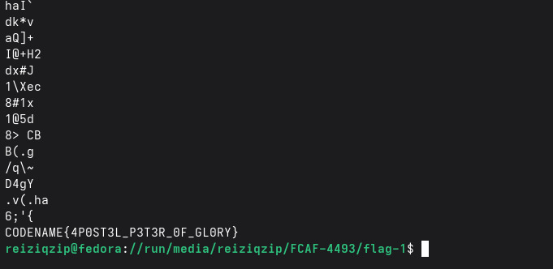
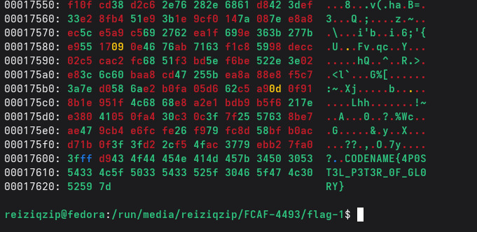

# Investigasi Forensik Digital - Kelompok 5

1. Barang Bukti berupa Flashdisk 32 GB merk Sandisk
2. Saat dibuka, hanya ada 1 file `opung_archive.jpg`
3. Analisa file `opung_archive.jpg` dengan tools `strings`

4. Analisa file `opung_archive.jpg` dengan tools `xxd`

Dari kedua tools itu, ditemukan flag **`CODENAME{4P0ST3L_P3T3R_0F_GL0RY}`**

**Status:** Solved